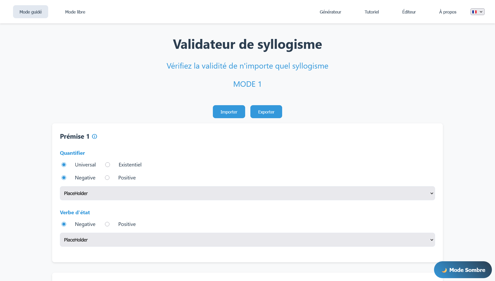
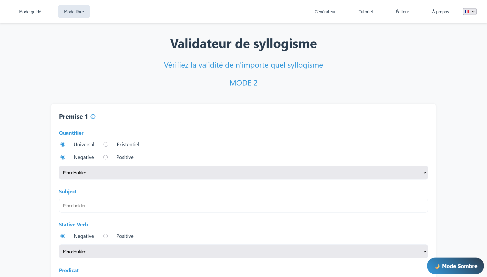
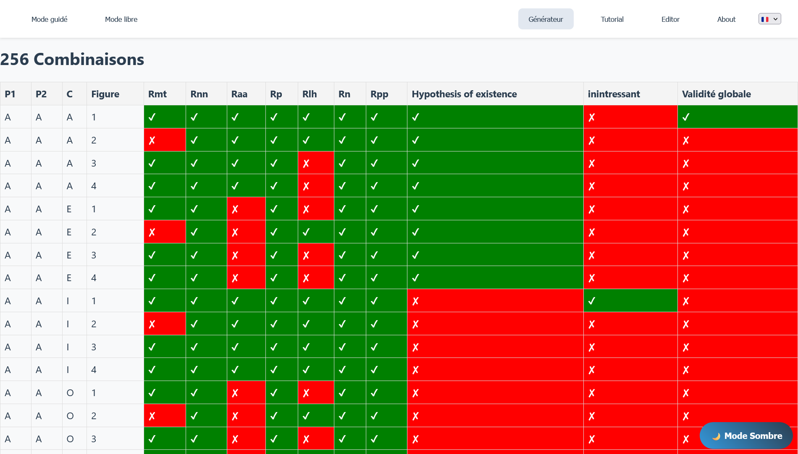
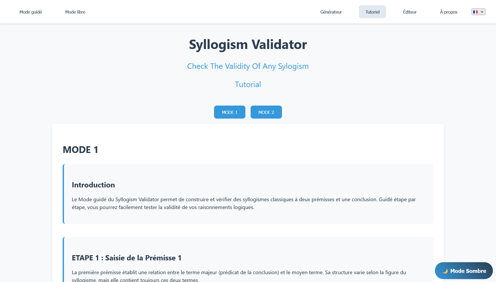
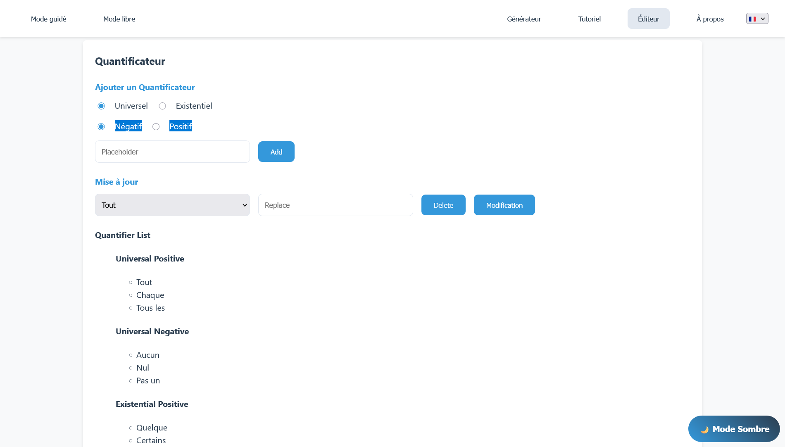

# Polysyllogism Validator
EDUCATIONAL LOGIC TOOL - Student Project

This project was developed as part of a university project by a team of 5 students. It is an educational tool for first-year undergraduate students to help them learn and validate logical reasoning in the form of syllogisms.

## Table of Contents

- [Polysyllogism Validator](#polysyllogism-validator)
  - [Table of Contents](#table-of-contents)
  - [Project Information](#project-information)
  - [Project Overview](#project-overview)
  - [Screenshots](#screenshots)
  - [Features](#features)
    - [Usage Modes](#usage-modes)
    - [Interface and Ergonomics](#interface-and-ergonomics)
  - [Technologies Used](#technologies-used)
  - [How to Use](#how-to-use)
  - [Installation and Setup](#installation-and-setup)
    - [Prerequisites](#prerequisites)
    - [Installation](#installation)
    - [Development](#development)
    - [Testing](#testing)
    - [Deployment](#deployment)
  - [Project Structure](#project-structure)
  - [Future Improvements](#future-improvements)

## Project Information

- **Project Type**: Educational logic tool
- **Context**: University team project
- **Development Team**: 5 students
- **Duration**: 3 months
- **Year**: 2024
- **Main Language**: TypeScript
- **Target Platform**: Web application

## Project Overview

The Polysyllogism Validator is an educational tool designed to help first-year undergraduate students understand and master logical reasoning. The application allows users to:

- **Build syllogisms** in a guided or free-form manner
- **Automatically validate** the logic of reasoning
- **Learn** through an integrated tutorial
- **Practice** with two modes (syllogism and polysyllogism)

## Screenshots

**Guided Mode**



**Free Mode**



**Combination Generator**



**Tutorial**

 

**Quantifier Editor**



## Features

### Usage Modes

- **Guided Mode**: Step-by-step construction
- **Free Mode**: Creation of complex syllogisms
- **Tutorial Mode**: Learning to understand syllogisms and use the software
- **Generator**: Combination generator
- **Advanced Editor**: Interface for adding quantifiers

### Interface and Ergonomics

- **Multilingual interface**: Support for French and English
- **Responsive design**: Adaptation to different screen sizes
- **Intuitive navigation**: Guided workflow for beginners
- **Contextual help system**: Integrated tooltips

## Technologies Used

- **Main Language**: TypeScript
- **User Interface**: HTML5/CSS3
- **Bundling and Compilation**: Node.js configuration
- **Automated Testing**: Jest with code coverage
- **Documentation**: TypeDoc for automatic generation
- **Internationalization**: Modular translation system
- **Development Tools**: ESLint, Prettier, and debugging tools

## How to Use

1. **First Launch**:
   - Start with Tutorial mode to learn the basics
   - Familiarize yourself with the structure of syllogisms

2. **Guided Mode** (recommended for beginners):
   - Follow the steps suggested by the interface
   - Use suggestions to build your reasoning
   - Validate each step before moving to the next

3. **Free Mode** (for advanced users):
   - Create your syllogisms
   - Test complex reasoning

## Installation and Setup

### Prerequisites

- **Node.js** (version 16 or higher)
- **npm** as package manager

### Installation

1. **Clone the repository**:

2. **Install Node.js**:

   **Windows**:
   - Download from [nodejs.org](https://nodejs.org/)
   - Install the recommended LTS version
   - Verify installation:
   ```bash
   node --version
   npm --version
   ```

   **Linux (Ubuntu/Debian)**:
   ```bash
   sudo apt update
   sudo apt install nodejs npm
   node --version
   npm --version
   ```

3. **Install dependencies**:
   ```bash
   npm install
   ```

### Development

1. **Project compilation**:
   ```bash
   npm run build
   ```
   This command:
   - Cleans the `dist/` folder
   - Compiles TypeScript files
   - Copies all necessary assets

### Testing

```bash
# Run all tests
npm run test

# Tests with code coverage
npm run test:coverage
```

Coverage reports are generated in `coverage/lcov-report/index.html`

### Deployment

1. **Production build**:
   ```bash
   npm run build
   ```

2. **Launch with Live Server** (VS Code):
   - Install the "Live Server" extension
   - Navigate to `dist/html/index.html`
   - Right-click → "Open with Live Server"

3. **Web deployment**:
   - Upload the contents of the `dist/` folder to your server
   - Configure your server to serve static files

## Project Structure

```
PROJET_SYLLOGIS/
├── coverage/              # Jest test coverage reports
├── dist/                  # Compiled code ready for execution
├── html/                  # Application web pages
├── langage/               # Multilingual internationalization system
├── node_modules/          # Node.js dependencies
├── public/                # Public resources
├── ressources/            # Project assets and resources
├── styles/                # CSS stylesheets
├── ts/                    # TypeScript source code
├── .gitignore
├── jest.config.cjs        # Jest test configuration
├── package-lock.json
├── package.json           # npm dependencies and scripts
├── README.md              # This documentation
└── tsconfig.json          # TypeScript configuration
```

## Future Improvements

**Technical Aspects**:
- Migration to a modern framework (React/Vue.js)
- User progress saving
- Complete offline mode

**User Experience**:
- Syllogism editor with auto-completion
- Personalized recommendation system
- Detailed progress statistics
- PDF exercise creation

  ## Licence

Academic project - Université de Poitiers (2024)

---

*University project at University of Poitiers - Team of 5 developers - 2024*
